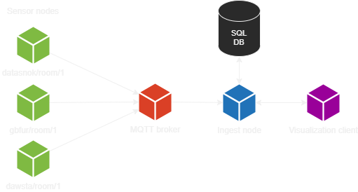
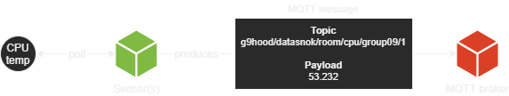
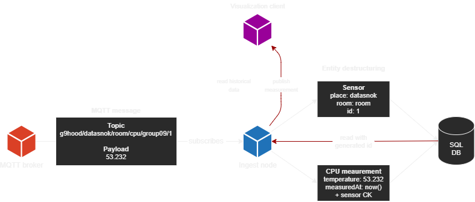
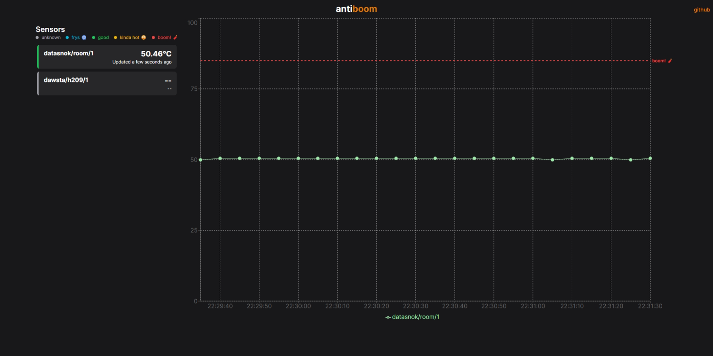

<br />
<div align="center">
  <a href="#abstract">
    
  </a>

  <p>
    don't let it explode.
    <br />
    <a href="#43-installation--usage"><strong>Get started »</strong></a>
</div>

<p align="center">This is an educational project in the course IDATA2304 Computer Networks at NTNU.</p>

## Abstract
There is a growth of technological applications being connected to the internet. These applications are members of numerous industries that may require the appliances responsible for said applications to run under challenging environmental circumstances. Information screens and fuel price signs are two examples of where such appliances may be used. Appliances running information screens may for instance have limited airflow, potentially resulting in degraded cooling. To ensure longevity of the installed appliances used to run said applications, we need to be aware of their working conditions, and be warned if these conditions worsen to a state that could be of potential harm to either the appliance itself or its surroundings. In this project, we have created a prototype health monitoring system for appliances. The system measures the CPU temperature of devices, and is capable of showing a real-time graph with updates as measurements are processed. It also offers an optional Discord integration for message notifications on temperature measurements which exceed a threshold. The system can be further expanded upon in order to support different kinds of measurements, such as the amount of processing power being used or environmental conditions to further help describing the working conditions.


## 1 Introduction

Antiboom is our solution to the Autumn 2022 IDATA2304 Computer Networks project which involves building a prototype of a meaningful IoT application. The application is a Raspberry Pi health monitor which periodically logs processor temperature(s) and displays them in a user-friendly fashion on a web interface. The main idea stems from the potential problem that arises when IoT devices are placed in hot environments, such as inside fuel price signs at gas stations, where the temperatures may exceed what is considered safe for the device. The goal of the application is to prevent any potential device damage by providing a real-time graph of temperatures within a set time period, which in turn helps discover any flaws with the device, such as broken fans or heat sinks.

## 2 Technologies

A range of protocols are applied in this project, with the two main building blocks being MQTT and HTTP.

MQTT is a lightweight publish-subscribe messaging protocol for Internet of Things applications ([Wikipedia 2022][wikipedia-mqtt]). MQTT is an abbreviation for the previously called Message Queuing Telemetry Transport. Being one of the project's required protocols, it is responsible for publishing the temperature data of a sensor node to a defined topic on a broker, as well as subscribing to said topic in order to enable data reception. MQTT is an application layer protocol that utilizes a TCP connection to a broker, to send or receive messages.

HTTP, short for Hypertext Transfer Protocol, is a fundamental client-server protocol for data exchange on the Web. It can be used to, for instance, fetch resources such as HTML documents. HTTP is also, like MQTT, an application layer protocol making use of a TCP connection to exchange data. The HTTP protocol specifies a set of methods that help differentiate the purpose of a request. In this project, we take advantage of two of these methods: GET and POST. GET requests typically indicate that the requesting client wants to fetch a resource from a HTTP server. POST requests, on the other hand, typically indicate that the client wants to upload a new entity to a resource ([MDN 2022][mdn-http]). 

In cases where extra metadata is useful to narrow or guide the HTTP server as to what the client is looking for, query parameters can be used. Query parameters are key-value pairs of strings encoded as query strings in the HTTP request URL, and appended at the end of it. In this project, they are used to give the server a parameter that we can use to limit the response to what is beneficial to the user ([Wikipedia 2022][wikipedia-query-strings]).

Data being uploaded to or sent from a HTTP server is typically encoded using a predetermined format in the body. The kind of encoding used varies and is defined in the request and response `Content-Type` header ([MDN 2022][mdn-http-post]). In this project we have decided to utilize JSON encoding. JSON is short for JavaScript Object Notation and the encoding format stems from the representation of objects in the JavaScript programming language. JavaScript is a scripting language originally made for web pages ([MDN 2022][mdn-javascript]). It allows for more dynamic behaviour than what is achievable using plain HTML and CSS.

Client-side web applications can be built in numerous ways. Our application is built with TypeScript, another programming language built on top of JavaScript. To represent our user interface in a declarative manner, we use React as a framework. The source code is a mix of TypeScript and HTML markup (tsx), grouped into reusable bits where applicable. TypeScript code in React can be compiled to JavaScript equivalents and furthermore bundled as HTML and JavaScript files that can be served on a HTTP server. The client-side application makes use of the Fetch Browser API to fetch JSON data from the ingestion service. Since JSON objects are how objects are represented in JavaScript, we do not have to serialize our responses in the client application.

HTTP also supports persistent connections. Such connections may be used for event-like data transfer, using a technique called server-sent events. The technique is similar to MQTT, where subscribing clients open connections to a HTTP server and receive events in a way determined by the HTTP server. In browsers, there is an API named EventSource that can help interacting with these server-sent events. 

There are a lot of ways to build applications, but we have decided to use Spring Boot. Spring Boot has a set of starters and integrations that provide a lot of functionality. Examples include a web server and client, database integration using JDBC, MQTT client integration and cron based scheduling support. In addition, they have support for bundling the application as a native binary using GraalVM. 

In order to have the ability to reliably access historical data, across different runs of the application, they have to be saved in a persistent manner. Relational databases is one of many ways to save data to a persistent store. These databases typically use SQL, short for Structured Query language, for data definition and manipulation ([Wikipedia 2022][wikipedia-sql]). We use H2 as our database of choice, and utilize the Spring Boot JPA integration to interact with it. To evolve the database schema, we use Liquibase, which is a tool to migrate the database schema to a desired state. 


<a href="#abstract">
  <p align="right">
  To top
  </p>
</a>


## 3 Methodology
The application was developed in 1 week long sprints, with each of the sprints documented [here](docs/sprints/index.md). This was done both to fullfill one of the project requirements (use of agile work methodology), but also because we have had positive former experiences with this type of workflow and believed it would work just as well for this assignment.

Starting the week the assignment was handed out, our group used every tuesday to finalize a sprint and start a new one. This included discussing and writing a short report about the sprint, as well as planning, defining and assigning tasks as issues on our [GitHub issue board](https://github.com/users/thedatasnok/projects/2/). This usually went by smoothly as we had no problems distributing the issues according to our interests while keeping the workload mostly fair.

Each thursday, we used the available classroom hours to meet in person and work on the project together. We did this to clear up any potential confusion about the assigned work, as well as help each other with mostly, but not only, programming-specific things.


<a href="#abstract">
  <p align="right">
  To top
  </p>
</a>


## 4 Results

### 4.1 Architecture
The project requires a minimum of two nodes programmed by the students, which is achieved and further abstracted into a total of four components in control:
- Sensor nodes
- Ingestion service
- SQL database
- Visualization service

The below diagram shows how the components are connected to each other. The sensor nodes connect to a MQTT broker, and send any measurements to that broker. The ingestion service subscribes to the broker and saves measurements to the database. The visualization service communicates with the ingestion service and fetches data from it, which is then displayed to the user. 


<br />

<div align="center">
  
</div>

<br />


The sensor nodes are programmed to send measurements to a configured MQTT broker. Metadata about the sensor is configured on installation and encoded in the message topic. The measurement is encoded in the message payload. Each measurement is polled from the sensor nodes CPU temperature readings every 5 seconds and sent to the broker. The scheduling is handled by Spring's scheduling capabilities. 

<br />

<div align="center">
  
</div>

<br />

Once a measurement is received at the MQTT broker, the MQTT broker forwards the message to any clients listening to topics matching this pattern. In this case, to support multiple sensors, a pattern matcher is used to listen to all topics that match the pattern `g9hood/+/+/cpu/group09/+`. The ingestion service subscribes to the broker using this pattern, and receives all messages sent to the broker using that pattern as their topic. 

As messages are received in the ingestion service, they are processed before being persisted. The message topic is destructured into a set of sensor metadata, and the message payload is parsed into a measurement object. Both objects are then saved to a database. The Spring Boot JPA integration is used to communicate with the database, which is H2 in this case. The usage of H2 results in a less complex setup, and is stored directly to a file on the system. 

<br />

<div align="center">
  
</div>

<br />

As the ingestion service saves measurements to the database, it reads out the inserted row from the database including generated fields, such as the primary key and creation date. It uses the read information to produce an event internally in the application, allowing to further notify any recipients of the event. This is accomplished using Spring's event system. 

There are two event listeners in the ingestion service that listen to this event. One of them is an event forwarder, which forwards any of the stored measurements to clients using the visualization service through Server-sent events. Any of the visualization clients that are listening to the events using an EventSource, will receive the newly processed measurement and can add it to the visualization. 

In addition to forwarding the events, there is another listener that represents a notifier. The notifier is optionally configured by the administrator of the service, and can send messages to a configured Discord channel. The notifier determines whether the saved measurement exceeds a configured threshold. If it exceeds, a POST request is sent to the configured webhook using Spring's RestTemplate functionality, which results in a message being sent in the channel.

The visualization service is not only capable of receiving new updates, it also reads recent historical measurements from the ingestion service. The visualization uses the web browser Fetch API to send HTTP requests to the ingestion service. The ingestion service employs the Spring Boot Web integration to implement HTTP endpoints that read from the database and encode objects as JSON before responding to the client's request. This mechanism is used to fetch initial data for the graph and metadata for sensors. The measurement data fetched is narrowed using a query parameter, which defines the time after which the measurements should be queried. The narrowing prevents the graph from extending too far into the past, and only shows the most recent measurements. 

In order to update the graph and sensor details displayed on the web page, the state functionality in React is used. As the visualization service receives or reads measurements and sensor metadata, it updates the state of the application. The change of state causes React to re-render the page, resulting in the graph and sensor details updating. 


### 4.2 Bundling

Both the ingest and sensor applications are capable of being bundled using GraalVM. This means that they can be run as native binaries, without the need for a JVM. This has reduced the amount of resources required to run the applications, as well as reducing the startup time. It also simplifies the installation of the application, as there is no prerequisite for a compatible JVM. As long as the sensor node is a Debian based system on an ARM64 architecture, the application can be installed using the provided installation script. As for the ingestion service, we still only provide a JAR file that can be used by a compatible JVM, but it is possible to bundle it as a native binary. 

The visualization service is also included in the native binaries of the ingestion service. The React application built with TypeScript is bundled using Vite. The bundle is then copied inside the ingestion service and served by it. This means that the visualization service is not a separate deployment, but rather a part of the ingestion service. This simplifies the installation, as there is no need to install and run two separate applications. 

Released versions of the system are available on GitHub. In order to release a new version, the process as described [here](docs/releasing.md) can be followed. The release process is built using GitHub Actions, that will bundle the two applications as JAR for the ingest application and native binary for the sensor application. The release process creates a new release on GitHub, and uploads the bundled applications as artifacts. 


### 4.3 Installation & Usage
In order to set up or install the software you will need the following: 
- An ARM64 sensor node running a Debian based operating system
- A computer with Java 17 (LTS) installed

Both devices will need an internet connection.


#### 4.3.1 Installing sensor nodes
This step requires you to have an ARM64 based computer running a Debian based operating system. 
During our testing, we have run the 64-bit version of Raspberry Pi OS Lite.

1. Log in as or elevate your shell to the root user.

    ```sh
    sudo su
    ```

2. Run the following to invoke the install script: 

    ```sh
    bash <(curl -s https://raw.githubusercontent.com/thedatasnok/idata2304-iot-project/main/tools/install-sensor.sh)
    ```

3. Fill out details about the MQTT connection

    **Note:** the client ID needs to be unique per client


#### 4.3.2 Installing the ingest/visualization node
This step can be run on any computer compatible with Java 17, installing Java is a prerequisite. 
For instance, on a debian based system, it can be installed running: `apt install openjdk-17-jre-headless`

1. Download the latest version of ingest from [GitHub][release-latest]

2. Set up environment variables for the service, an exhaustive list of required variables:

    `DB_USERNAME` the database username to use
    
    `DB_PASSWORD` the database password to use
    
    `MQTT_BROKER_IP` the MQTT brokers IP address
    
    `MQTT_BROKER_PORT` the MQTT brokers port
    
    `MQTT_CLIENT_ID` the unique client id for this application
    
    
    Optionally set the following to be notified in a Discord channel when a measurement exceeds the threshold:

    `NOTIFIER_ENABLED` set to `true` to enable the notifier

    `NOTIFIER_DISCORD_WEBHOOK_URL` the Discord webhook URL to use for sending messages

    `NOTIFIER_CPU_TEMPERATURE_THRESHOLD` the threshold for the CPU temperature in degrees celsius

    

3. Run the application `java -jar ingest-1.0.0.jar`


#### 4.3.3 Usage
Once the ingest/visualization node is set up as described in [4.3.2](#312-installing-the-ingestvisualization-node), you can open up the user interface by visiting: http://localhost:8080/ in your browser.


The sensor node is meant to run in the background unattended, but in case of errors you can control the service using `systemctl`. 

### 4.4 User interface

The main focus of the user interface was to keep it simple. It is built using React and TypeScript and is bundled into the ingestion service which can be installed as described in [4.3.2](#432-installing-the-ingestvisualization-node). The figure below shows the user interface of the application, with the graph visualization on the right and sensor details on the left. The graph and sensor details are updated as new measurements are stored in the database, as described in [4.1](#41-architecture).

<div align="center">
  
</div>

<a href="#abstract">
  <p align="right">
  To top
  </p>
</a>


## 5 Discussion

The choice of technologies slots in nicely with a combination of prior experience and possibilities to learn new concepts and technologies. The pairing of SQL for persistent storage of measurement data and Spring Boot, lead to a relatively quick development of both the ingestion service and the sensor application. The main portion of the system is built using Java, a language in which all of the team members have experience. 

In addition to Spring Boot, we used a combination of React and TypeScript for the visualization service. Most of the team members are new to these technologies, but the project's slim scope resulted in it being a decent fit to be introduced to them. 

In the project, we decided to integrate to a Discord channel for notifications. Discord may not have a strong level of cohesion with the problem domain, but serves as a good example, because the knowledge required to integrate with it is minimal. This choice was mainly made to emphasize the possibilities for analyzing the stored measurements, and providing notifications based on a condition that is met. 

During the project, we experienced few deviations from what initially had been planned. There were a few times where we were not able to finish all activities planned in sprints, however most of them were completed as planned. Sometimes we even found time to slot in extra work, outside the initial plan of a sprint. 

The system has been tested using a ready to use public MQTT broker distributed by the teachers of this project. While this is handy solution for the scope of this project, it still opens up for some security issues. Malicious attacks can target our application by sending messages to the MQTT broker with the same topic structure, this would lead the ingestion service of the system picking up unwanted messages and creating spam. This is not a major issue, since the application can be configured to use an MQTT broker of choice using the environment variables as specified in [4.3.2](#432-installing-the-ingestvisualization-node). While it currently does not support using username and password for authentication, it is a feature that can be added in the future. 

The lack of protection on the used MQTT broker may open up for some Denial of Service attacks. The speed of which the ingestion service is able to process requests is reliant on the speed of the database, which is controlled by the I/O capabilities of the host system. In addition to DoS types of attacks, there is also the possibility that a malicious actor could send meaningless data to the same topics as other sensors, which may cause the integrity of the data to be compromised.

The data transmitted with the public MQTT broker and the sensor nodes is open and not encrypted. A possible solution would be to connect to an MQTT broker using encrypted protocols, but the message payload is still in clear format at the broker side. This can be mitigated through encrypting the payload using symmetric key encryption or equivalent solutions, allowing the sensor application to encrypt while the ingestion service needs to decrypt it. While encrypting the data with said methods would be possible, we have deemed it not too important in the current state of the project as the only information being encoded in the message payload is temperature measurements. If further development of the sensors results in more sensitive data being transmitted, it would be a good idea to implement some level of encryption. 


<a href="#abstract">
  <p align="right">
  To top
  </p>
</a>

## Conclusion and future work
As part of the Autumn 2022 IDATA2304 Computer Networks project, our group developed a prototype of Antiboom - a Raspberry Pi health monitor. It should act as proof of concept for what could ensure longevity of appliances used to run applications under challenging environmental circumstances. In its current state, it is an application consisting of four components in control, namely sensor nodes, an ingestion service, an SQL database and a visualization service. A range of technologies and protocols was used to develop the project, with MQTT and HTTP being the two main building blocks. The development process consisted of 1 week long sprints, starting each tuesday by documenting the previous sprint and planning the next one. Antiboom sensor nodes can currently be installed on ARM64-based computers, and the visualization service - a Web interface - on any computer running Java 17.

Even though the current version of Antiboom fulfills the minimum requirements of the project, it is still a prototype. Some of the ideas initially written down in our [brainstorm document](docs/brainstorm.md), and some we thought of during development, did not make it in due to various reasons; time constraint being the main one. The following is a list of potential future work and possibilities for expansion:

- Our instances of the application currently utilizes a public MQTT broker. Though the amount of damage to be done through an attack on it during development is arguably low, utilizing a self-hosted broker would be a necessity in a real scenario.

- One of the initial ideas for the Web interface was to display the minimum, average and maximum temperatures over a set period of time. This could be implemented through SQL queries and some statistics work.

- A customizable maximum temperature threshold instead of a fixed one at 85° C.

- More channels for notifications to make the application more universal. Currently implemented through Discord, though ideally to be expanded to E-mail and/or SMS.

- Offline buffering, if a node loses connection to internet - can we store the measurements locally and send them when the connection is restored? 

- Offline detection, can the sensor nodes measurements to detect if the node is offline?

- Measuring multiple variables that may help describe the working conditions of a node better, perhaps expand to a dynamic way of configuring measurements.


<br />

<a href="#abstract">
  <p align="right">
  To top
  </p>
</a>


## References
- Wikipedia. *MQTT*. Accessed 24th of November 2022. [link][wikipedia-mqtt]
- Mozilla MDN. *HTTP*. Accessed 24th of November 2022. [link][mdn-http]
- Wikipedia. *Query string*. Accessed 24th of November 2022. [link][wikipedia-query-strings]
- Mozilla MDN. *POST - HTTP*. Accessed 24th of November 2022. [link][mdn-http-post]
- Mozilla MDN. *JavaScript*. Accessed 24th of November 2022. [link][mdn-javascript]

[wikipedia-mqtt]: https://en.wikipedia.org/wiki/MQTT
[mdn-http]: https://developer.mozilla.org/en-US/docs/Web/HTTP
[wikipedia-query-strings]: https://en.wikipedia.org/wiki/Query_string
[mdn-http-post]: https://developer.mozilla.org/en-US/docs/Web/HTTP/Methods/POST
[mdn-javascript]: https://developer.mozilla.org/en-US/docs/Web/JavaScript
[wikipedia-sql]: https://en.wikipedia.org/wiki/SQL

TODO: add links to technologies

[mqtt]: https://
[tcp]: https://
[http]: https://
[json]: https://

[gradle]: https://
[java-17]: https://
[spring-boot]: https://
[h2-sql]: https://
[liquibase]: https://
[pnpm]: https://
[typescript]: https://
[react]: https://
[vite]: https://
[tailwind-css]: https://
[recharts]: https://

[release-latest]: https://github.com/thedatasnok/idata2304-iot-project/releases/latest