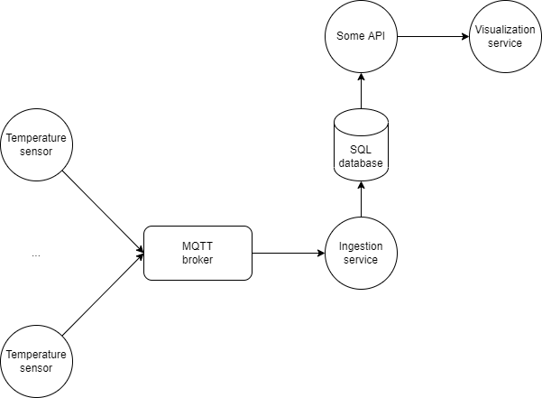

# Architecture

The project uses the following architecture:

With the following components in our control:
- Sensor nodes
- Ingestion service
- SQL database
- Visualization service

## Sensor nodes
Each sensor node runs a MQTT client. 

The sensed data is sent to a MQTT broker, with it's own unique topic.

The sensor nodes follows this format for topics:
- `g9hood/dawsta/<room-id>/cpu/group09/<sensor-id>`
- `g9hood/datasnok/<room-id>/cpu/group09/<sensor-id>`
- `g9hood/gbfur/<room-id>/cpu/group09/<sensor-id>`

These can either be subscribed to specificly, or by using the following pattern:
- `g9hood/+/+/cpu/group09/+` 

## Ingestion service
The MQTT broker has a subscriber, an "ingestion" service - which is responsible for consuming the messages from the MQTT broker and storing it in a structured manner in the database.

## Visualization service
As a link between the consumed data and the end user, we have a visualization service which is responsible for displaying the structured data stored in the database in a human readable way.

The visualization service retrieves data from the database using "Some API".

