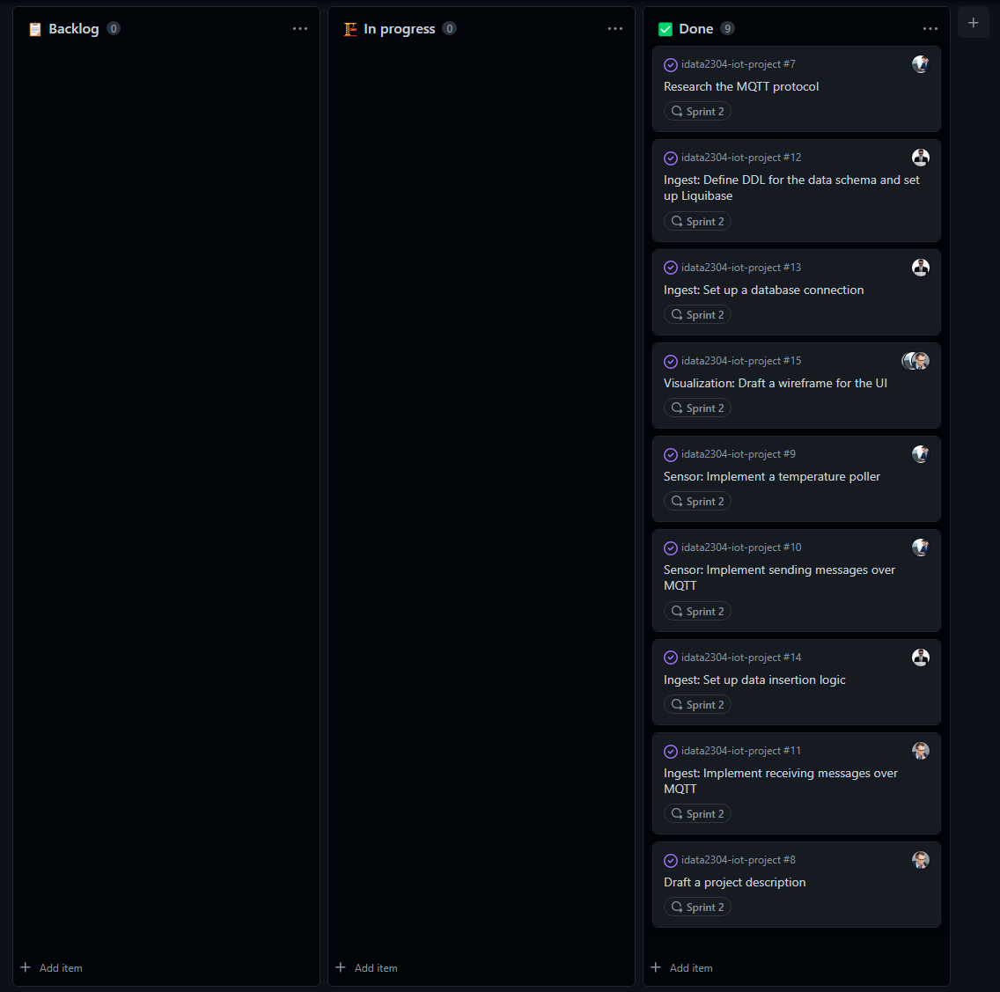

# Sprint 2 (Oct 25 - Oct 31)

## Sprint review

### Goals for this sprint
🎯 Research the  MQTT protocol 

🎯 Draft a project description

🎯 Implement a temperature poller

🎯 Implement sending messages over MQTT

🎯 Implement receiving messages over MQTT

🎯 Define DDL for the data schema and set up Liquibase

🎯 Set up a database connection

🎯 Set up data insertion logic

🎯 Draft a wireframe for the UI

### What goals were accomplished this sprint?

✅ Research the  MQTT protocol 

✅ Draft a project description

✅ Implement a temperature poller

✅ Implement sending messages over MQTT

✅ Implement receiving messages over MQTT

✅ Define DDL for the data schema and set up Liquibase

✅ Set up a database connection

✅ Set up data insertion logic

✅ Draft a wireframe for the UI

### What extra has been done this sprint?
Wired up received messages to store measurements in the database.

## Sprint retrospective

### What would we do differently?
No comments.

### What should we keep doing?
- Keep planning issues and assigning them.
- Keep steady workflow.
- Keep using lab sessions to collaborate.

### What went well?
- Managed to do all issues, and some unplanned extra activities.

### What can be improved?
No comments.

