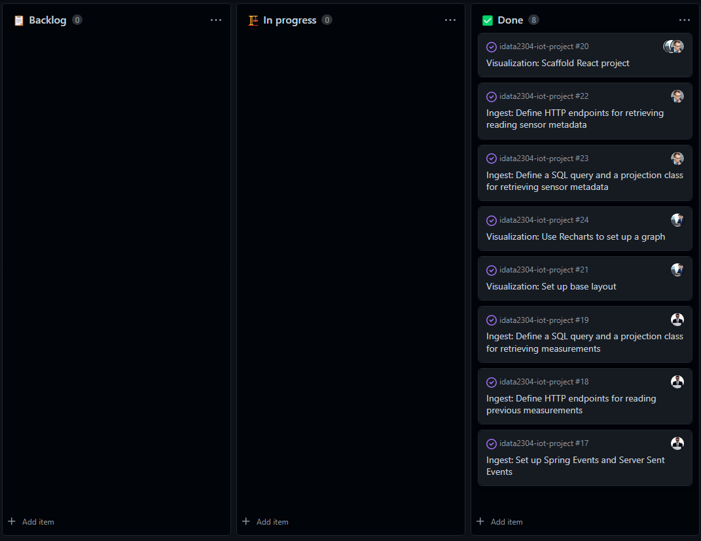

# Sprint 3 (Nov 01 - Nov 07)

## Sprint review

### Goals for this sprint
🎯 Set up Spring Events and Server Sent Events

🎯 Define HTTP endpoints for reading previous measurements

🎯 Define a SQL query and a projection class for retrieving measurements

🎯 Scaffold a React project

🎯 Set up base layout

🎯 Define HTTP endpoints for retrieving sensor metadata

🎯 Define a SQL query and a projection class for retrieving sensor metadata

🎯 Use Recharts to set up a graph

### What goals were accomplished this sprint?
✅ Set up Spring Events and Server Sent Events

✅ Define HTTP endpoints for reading previous measurements

✅ Define a SQL query and a projection class for retrieving measurements

✅ Scaffold a React project

✅ Set up base layout

✅ Define HTTP endpoints for retrieving sensor metadata

✅ Define a SQL query and a projection class for retrieving sensor metadata

✅ Use Recharts to set up a graph

## Sprint retrospective

### What would we do differently?
No comments.

### What should we keep doing?
- Keep working steadily
- Keep working on campus in lab sessions
- Keep planning and assigning issues

### What went well?
- Managed to do all planned activities

### What can be improved?
- Sleep schedule
