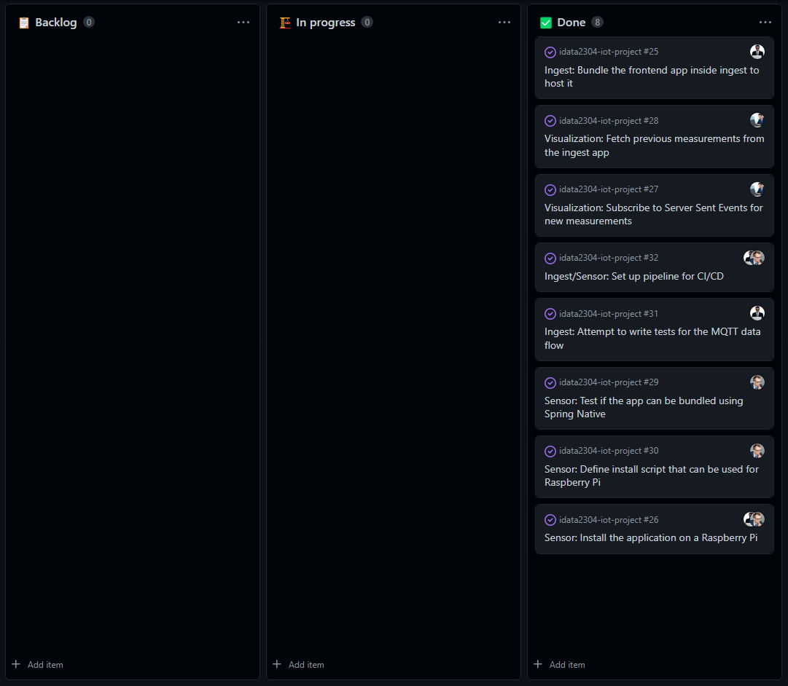

# Sprint 4 (Nov 08 - Nov 14)

## Sprint review

### Goals for this sprint
🎯 Bundle the frontend app inside ingest to host it

🎯 Install the sensor application on a Raspberry Pi

🎯 Subscribe to Server Sent Events for new measurements

🎯 Fetch previous measurements from the ingest app

🎯 Test if the sensor app can be bundled using Spring Native

🎯 Define install script that can be used for Raspberry Pi

🎯 Attempt to write tests for the MQTT data flow in ingest

🎯 Set up pipeline for CI/CD

### What goals were accomplished this sprint?
✅ Bundle the frontend app inside ingest to host it

✅ Install the sensor application on a Raspberry Pi

✅ Subscribe to Server Sent Events for new measurements

✅ Fetch previous measurements from the ingest app

✅ Test if the sensor app can be bundled using Spring Native

✅ Define install script that can be used for Raspberry Pi

✅ Attempt to write tests for the MQTT data flow in ingest

✅ Set up pipeline for CI/CD

## Sprint retrospective

### What would we do differently?
No comments.

### What should we keep doing?
- Keep working steadily
- Keep working on campus in lab sessions
- Keep planning and assigning issues

### What went well?
- Managed to do the planned activities

### What can be improved?
No comments.
