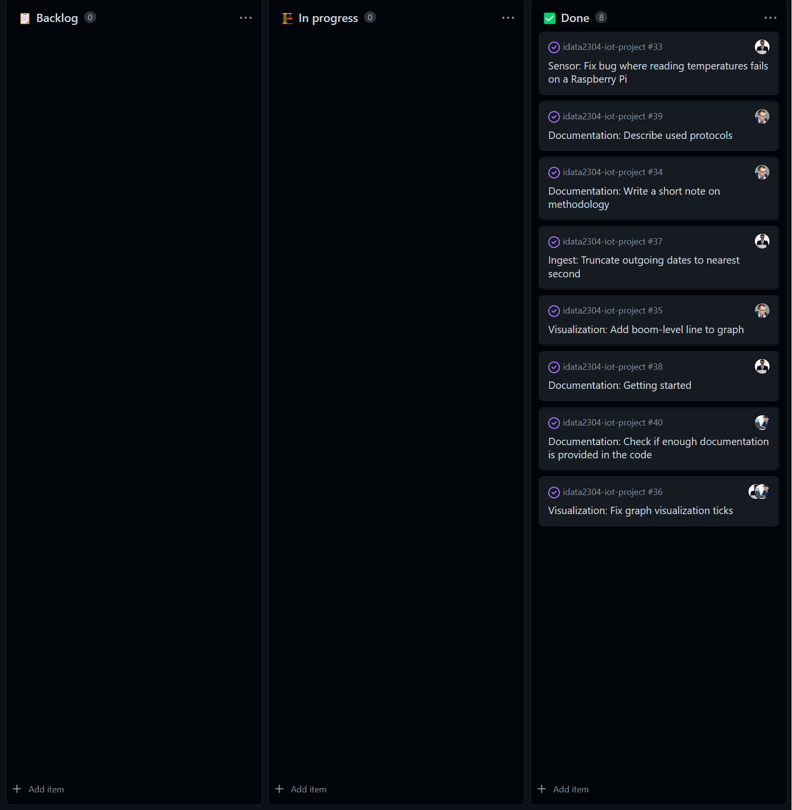

# Sprint 5 (Nov 15 - Nov 21)

## Sprint review

### Goals for this sprint
🎯 Fix bug where reading temperatures fails on a Raspberry Pi

🎯 Write a short note on methodology

🎯 Add boom-level line to graph

🎯 Fix graph visualization ticks 

🎯 Truncate outgoing dates to nearest second

🎯 Getting started section (documentation)

🎯 Describe used protocols

🎯 Check if enough documentation is provided in the code

### What goals were accomplished this sprint?
✅ Fix bug where reading temperatures fails on a Raspberry Pi

✅ Write a short note on methodology

✅ Add boom-level line to graph

✅ Fix graph visualization ticks 

✅ Truncate outgoing dates to nearest second

✅ Getting started section (documentation)

✅ Describe used protocols

✅ Check if enough documentation is provided in the code

### What extra has been done this sprint?
Added a fix for graph domain minimum to exclude stale sensors from the visualization graph.

## Sprint retrospective

### What would we do differently?
No comments.

### What should we keep doing?
- Keep planning issues and distributing them
- Keep working in lab sessions

### What went well?
- Managed to do all planned activities
- Fixed an extra flaw that was discovered during lab session

### What can be improved?
No comments.

