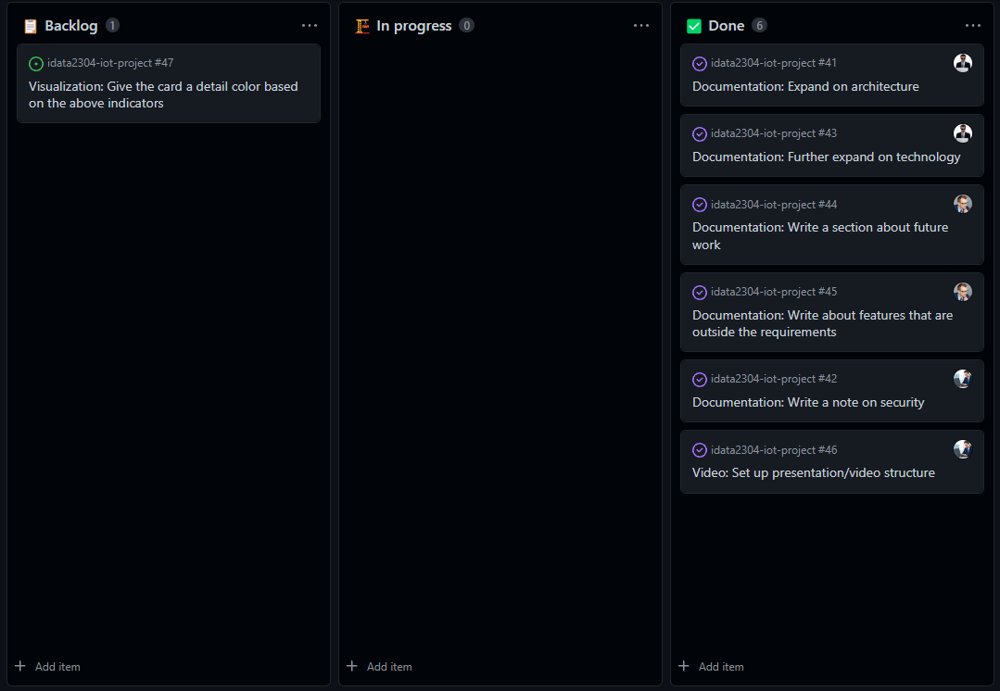

# Sprint 6 (Nov 22 - Nov 29)

## Sprint review

### Goals for this sprint
🎯 Expand on architecture section in report

🎯 Write a note on security

🎯 Further expand on technology section in report

🎯 Write a section about future work

🎯 Write about features that are outside the requirements

🎯 Set up presentation/video structure

🎯 Give the card a detail color based on the above indicators

### What goals were accomplished this sprint?
✅ Expand on architecture section in report

✅ Write a note on security

✅ Further expand on technology section in report

✅ Write a section about future work

✅ Write about features that are outside the requirements

✅ Set up presentation/video structure

❌ Give the card a detail color based on the above indicators
    *didn't do this because of sickness*

### What extra has been done this sprint?
Implemented a simple notifier for sending Discord messages to a channel when a sensor measures a temperature that exceeds a certain threshold.

Updated to Spring Boot 3 and made it possible to bundle the ingest application as a native image.

## Sprint retrospective

### What would we do differently?
- Don't be sick during the sprint :(

### What should we keep doing?
- Keep planning issues and distributing them

### What went well?
- Managed to do all assigned activities
- Managed to do some extra work

### What can be improved?
No comments.

