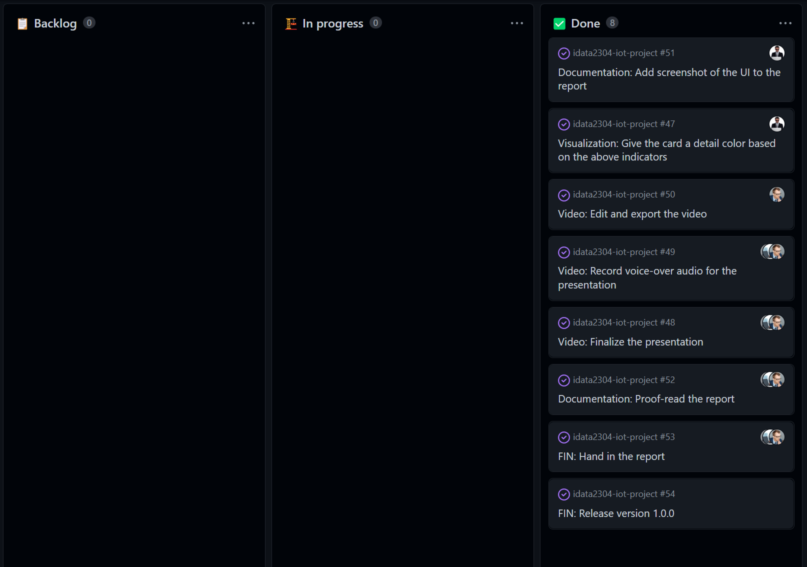

# Sprint 7 (Nov 30 - Dec 06)

## Sprint review

### Goals for this sprint

🎯 Give the card a detail color based on the above indicators

🎯 Finalize the presentation

🎯 Record voice-over audio for the presentation

🎯 Edit and export the video

🎯 Add screenshot of the UI to the report

🎯 Proof-read the report

🎯 Release version 1.0.0

🎯 Hand in the report

### What goals were accomplished this sprint?

✅ Give the card a detail color based on the above indicators

✅ Finalize the presentation

✅ Record voice-over audio for the presentation

✅ Edit and export the video

✅ Add screenshot of the UI to the report

✅ Proof-read the report

✅ Release version 1.0.0

✅ Hand in the report

## Sprint retrospective

### What would we do differently?
No comments. 

### What should we keep doing?
No more. (we're done 😀)

### What went well?
The project. 🧨

### What can be improved?
The project 

